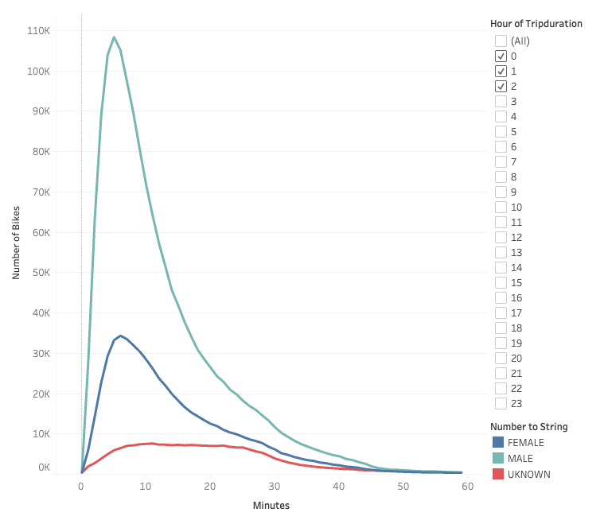

# Citi Bike Proposal
## Description
This analysis investigates the key demographic and service times to be targeted to implement a bike-sharing service in Des Moines, Iowa based off of data from Citi Bike.

## Data and Resources
### Data 
Data for this analysis is the August 2019 Citi-Bike data found [here](https://s3.amazonaws.com/tripdata/201907-citibike-tripdata.csv.zip)

This data was transformed using Pandas in [NYC_CitiBike_Challenge.ipynb](NYC_CitiBike_Challenge.ipynb).

### Resources
- Python v3.10.9
- Pandas v1.5.3
- Jupyter Notebook v6.5.2
- Tableau Public 22.4.0

## Analysis
In this analysis we ask two key questions:

1. What is the target demographic for this bike-sharing service?
2. During which times is there the greatest demand for bikes?

Let us examine the data with these questions in mind.

### Peak Hours

The y-axis represents the hour of the day in 24-hour time with the number of trips initiated during that hours along the x-axis. We see a peak in the 0800 - 0900 hours, with a much larger peak from the 1600 - 1900 hours. This suggest the use of the ride share before and after normal business hours (0900 - 1700).

<u>**Speculation 1**</u>: Those traveling to/from their places of business are a target demographic.

### Checkout Times

This line graph shows the time that a bike is checked out for a trip. For instance, it appears that the ~147,000 trips are only lasting around 7 - 8 minutes. The number of trips tapers off as the duration of the trip grows.

<u>**Speculation 2**</u>: Most of the trips are short distances.

### Gender Breakdown

Here we see that males make up nearly two-thirds of the rider base, females make up approximately one-quarter, and ~ 10% of riders' genders are unknown.

<u>**Speculation 3**</u>: Males are a target demographic.

### Checkout Times by Gender

This is the same as the Checkout Times graph, except that it breaks the checkout time down by gender. Speculation 2 is reinforced. Though we see that males taper quickly as trip duration grows, females less quickly, and the unknown genders have no noticeable peak. We would think to expect the unknown gender category to look at least similar to the distribution of males and females, but it doesn't.

<u>**Speculation 4**</u>: Those who take longer duration trips are less likely to share their gender because they are not subscription customers, rather one time use customers who take longer trips, e.g. recreational use.

### Number of Trips by Weekday

This heatmap shows data similar the Peak Hours chart, though by weekday. Notice that we see a more uniform distribution during daylight hours on the weekends compared with clusters around the beginning and endings of the business day on weekdays. This reinforces Speculation 1. 

<u>**Speculation 5**</u>: Given the somewhat uniform distribution of rides on the weekends, this suggests weekend rides are for recreational use.

### Number of Trips by Weekday by Gender

This heatmap is the same as above except it shows a breakdown by males and females. There is nothing particularly new of note, but Speculation 3 is reinforced.

### Number of Trips by Weekday by Gender and User Type

This heatmap shows a breakdown of number of trips by gender, usertype, and day of the week. Usertypes are as follows: Subscribers pay a regular fee to use the service, Customers are "pay-per-trip". The heatmap shows the unknown gender make up most of the Customer category, with clusters on the weekends. This reinforces Speculations 4 and 5. The large cluster of male subscribers reinforces Speculation 3 and introductes a new, though similar fact: most subscribers are males. It also introduces a new yet similar speculation:

<u>**Speculation 6**</u>: Most users are males who subscribe to the service and use the service to get to and from work.

### Final Speculation

<u>**Speculation 7**</u>: We can infer from Speculations 2 and 6 that most of the customers live relatively close to their place of employment.

## Findings
We now revisit our initial questions

### What is the target demographic for this bike-sharing service?
The principle demographic from above is males who live near their place of employment who need traportation to and from work. However, although males uses this service far more than females, females show a similar trend in using the service for travel to and from work. So even though males are the principle demographic, we should not engage in a male-centric marketing campaign.

Additionally, given that the above demographic will not be using the service on weekend (or will only do so sparingly), so the services should also market its recreational use on weekends and non-peak hours.

In summary the target demographic is
- Males
- Those who live close to work
- Recreational users

### During which times is there the greatest demands for bikes?
The greatest single demand for bikes is on Thursday evenings. The *why* of busy Thursdays is not evident in this data. But the other general trends for high demand are leading up to opening of business and following close of business of weekdays; and a steady use throughout the day on weekends.

We see other general trends, such as on Friday where there is a more gradual increase in demand at close of business compared to other weekdays.

In summary the times that are in most demand are
- Before opening of normal business hours
- After closing of normal business hours
- Throughout the day on weekends.

## Final thoughts
The above analysis is a good starting point to craft an idea for how to run a similar business in Des Moines. However, New York City is a significantly unique city compared to many other major metropolitan cities. We can expect a service like this to function well to some extent for people who tend to live in the city center. However, further due diligence is required to find and analayze data for the target city to ask if the above findings are reasonable cause to launch this business. For example, if Des Moines has a very small population of working professionals who live in the city center, the above findings may not be helpful in guiding further business decisions.